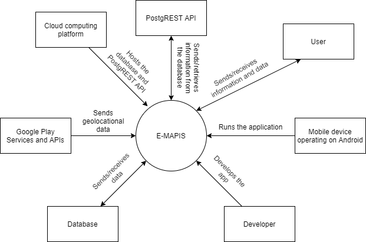
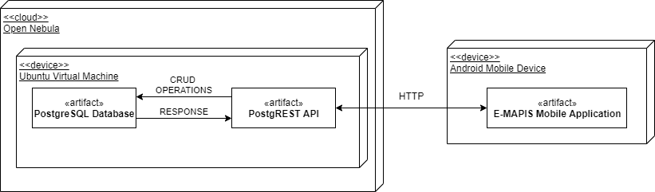
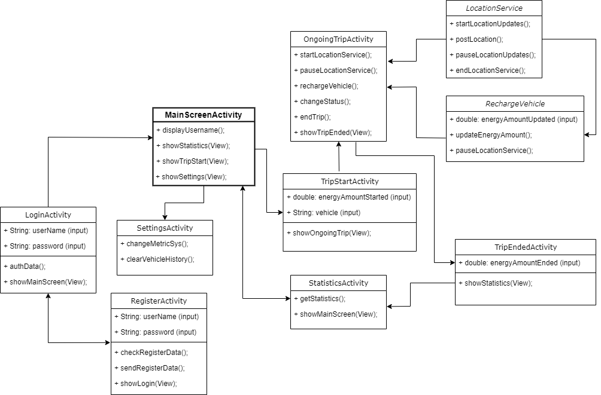

# **Table of contents**

- [**Table of contents**](#table-of-contents)
- [**1. Requirement’s specification**](#1-requirements-specification)
  - [**1.1. Purpose and summary of the project**](#11-purpose-and-summary-of-the-project)
  - [**1.2. A high-level overview of the system and functional requirements.**](#12-a-high-level-overview-of-the-system-and-functional-requirements)
  - [**1.3. Non-functional requirements**](#13-non-functional-requirements)
- [**2.Technical specification**](#2technical-specification)
  - [**2.1. An overview of the whole system**](#21-an-overview-of-the-whole-system)
    - [**2.1.1. System context diagram**](#211-system-context-diagram)
    - [**2.1.2. UML Deployment diagram**](#212-uml-deployment-diagram)
  - [**2.2. A high-level overview of the system internals**](#22-a-high-level-overview-of-the-system-internals)
    - [**2.2.1. Structural and Dynamic aspects**](#221-structural-and-dynamic-aspects)
  - [**2.3. Technologies and Tools**](#23-technologies-and-tools)

# **1. Requirement’s specification**

## **1.1. Purpose and summary of the project**

E-MAPIS is an application that, by collecting data about user's trips, car information, and geolocation data, delivers statistics for energy consumption for e-vehicles. By storing the statistics, the user will be able to view them at a later time to help determine and estimate the amount of energy that the trip will require. The application seeks to provide the user with stress-free planning of the trips and avoid unnecessary problems. Moreover, the data collected about energy consumption for specific vehicles will be compared to the data provided in the vehicle's manual.

## **1.2. A high-level overview of the system and functional requirements.**

| Technical:                                                                                                  |
| ----------------------------------------------------------------------------------------------------------- |
| As a Customer, I expect to be able to run the application on my Android device.                             |
| As a Customer, I want to create an account to have a layer of security with my data.                        |
| As a Customer, I want to have an account so I would not lose my statistical data in case of device failure. |
|                                                                                                             |

| Data Collection:                                                                                                             |
| ---------------------------------------------------------------------------------------------------------------------------- |
| As a Customer, I will provide the application with various trip and vehicle data to get statistics about my trips.           |
| As a Customer, I will be given a collection of statistics to help me plan trips better.                                      |
| As a Customer, I will be able to track my energy consumption throughout the period of time and this way track expenses. |
|                                                                                                                              |

| Functionalities:                                                                                                                         |
| ---------------------------------------------------------------------------------------------------------------------------------------- |
| As a Customer, I expect to be able to select my vehicle specification from a dropdown menu or add my own.                                |
| As a Customer, I expect my vehicle specification to be saved for a faster trip start, but easily changed if needed in the settings menu. |
| As a Customer, I want to be able to pause/resume my trip whenever needed.                                                                |
| As a Customer, I want to have the ability to input new energy levels if I recharged my vehicle.                                      |
|                                                                                                                                          |

In the flowchart below, an example of how the application from the user's perspective flows is displayed.

_Figure 1. System flow from the user's perspective_

Listed below are a wireframe representation of our the application side will work from the user's perspective

_Figure 2. User's perspective wireframe_

## **1.3. Non-functional requirements**
***
- **SECURITY**

The app will be using HTTPS requests to ensure data encryption. Sensitive geolocation data will be collected, to combat the privacy risk of such data collection, we will be cutting short parts of the trip (the beginning, the ending) and this way, even if there is a data breach, no precise locations would be revealed. There will also be an account creation step to have another layer of security.
***
- **COMPATIBILITY**

Application's minimum API level required to run the app is API level 22 or Android 5.1, since, by AndroidStudio statistics, 92.3% of devices can run it. The device to run the application will have to have at least 1.5 GB RAM to make the Android system work efficiently and fast.
***
- **USABILITY**

Most users, that have been using their Android smartphones and various applications on the device, will have no difficulties using and adapting to the E-MAPIS application since it uses a user-friendly interface, which does not have many entities or widgets in the main view. In addition, multiple themes will be available to combat color blindness.
***
- **SCALABILITY**

To ensure that the system can handle the projected increase in user traffic, data volumes, etc., various tests are done to determine the application's limits and its causes. Since the application is mostly based on databases, testing parameters are testing the size of the database in relation to the number of users, sent queries, data imports, etc.
***
- **PERFORMANCE**

The application itself will do minimal calculations in itself because everything is considered to be calculated in the database. Therefore, the application will not use a lot of the device's resources (this is yet to be determined fully when the application is developed). Responding to the user's data input should not take more than 5 seconds, because these are simple queries to the database, while responding to the user's navigation between pannels, will depend mostly on the hardware and its overload, it should not take more than also 5 seconds with minimal requirements.
***
- **ARCHITECTURAL DECISIONS**

For the relational database management system - PostgreSQL will be used.
For the service that is the medium for the connection between the
application and DBMS server - PostgREST will be used.
The application will be written using AndroidStudio in Java and XML.

# **2.Technical specification**

## **2.1. An overview of the whole system**

In order to build an understanding of how the system will be implemented, an overview of the whole system of the E-MAPIS application will be displayed and discussed in this section of the document. To display this information, two types of diagrams will be used: 
***
### **2.1.1. System context diagram**

To represent the entire system, which establishes the context and boundaries of the system to be modeled, a system context diagram (_Figure 3_) below will be used. In addition, it will help focus the attention on external factors and events that should be considered in developing the complete set of systems requirements and constraints.

*Figure 3. System context diagram*

At the center of the diagram, the entire software system is shown as a single process, without any details of the interior structure. The system is surrounded by all of its external entities that interact with the system:

* **Cloud computing platform.** Hosts the database server and the PostgREST web server.
* **PostgREST.** PostgREST web server turns the database server into a RESTful API, which sends or receives HTTP requests from the application.
* **User.** The user inputs and then sends data to the application, and in return receives information and data.
* **Mobile device operating on Android.** The E-MAPIS application is run on a mobile Android device.
* **Developer.** The developer develops new functionalities to the application, as well as, fixes bugs and issues.
* **Database server.** The database server sends or receives various data to and from the server. The data then gets sent to the user from the application.
* **Google Play Services and APIs.** Services that, for example, intelligently combines different signals to provide the location information, are included from the Google Play Services and APIs. The APIs and services, and how they interact with the system are listed and explained in more detail later in the document (_see paragraph 2.3_).
***
### **2.1.2. UML Deployment diagram**

The UML deployment diagram models the physical deployment of software components. In the diagram, hardware components, such as web server, smartphone device, are presented as nodes, with the software components that run inside the hardware components presented as artifacts.

*Figure 4. UML deployment diagram*

**Ubuntu Virtual Machine.**
A virtual machine on a cloud computing platform Open Nebula with an instance of Ubuntu-Server 20 installed, that connects to the E-MAPIS application. The virtual server consists of two artifacts: a relational database and a standalone web server. The server hosts the data in a PostgreSQL relational database with a PostGIS extension, that enables the support of GIS data type. In addition, the PostgREST web server turns the database into a RESTful API, to enable CRUD operations from the application and receive responses that are later on sent to the E-MAPIS Mobile Application.

**Android Mobile Device.**

The user's Android Mobile Device will be running the E-MAPIS application. The application's code is written in Java programming language, and the UI is formatted using XML, and generated by Android Studio automatic tools. The application uses HTTP communication library Volley, provided by Android Studio, which enables HTTP communication between the server and the application.
***
## **2.2. A high-level overview of the system internals**
### **2.2.1. Structural and Dynamic aspects**

In this section, we will explain how the dynamic aspects of the structural components will work together to provide the user with accurate statistics regarding their electric vehicle. For a visual explanation, we will use a UML Class diagram (_Figure 6._). A UML Class Diagram is a blueprint of the classes (code level) required to build the application.

*Figure 5. UML deployment diagram*

1. Launching the application, the user will be asked to log in to an existing account. The LoginActivity screen has two input fields that accept String data - the username field and the password field. When provided with the input, the application will call authData() method to authenticate the credentials provided by the user. If the authentication method succeeds, the showMainScreen() method will be called and the user will move to the main screen of the application. Otherwise, the user will be denied access to the main screen activity. If the user does not have an existing account, the user will have to register using the button provided in the log-in screen, which directs the user to the RegisterActivity.

2. The RegisterActivity screen will also have two String input fields for the username field and the password field. Once the user provides a unique username and sufficient password and clicks the "Register" button, the checkRegisterData() method will check if the provided credentials are sufficient and if so, sendData() method will send the data to the database to register the user. After that, the user will be redirected to LoginActivity and log in using the username and password combination used in registration.

3. The MainScreenActivity is the main view of the E-MAPIS application. On access, it will greet the user and provide  access to other activities of the application via buttons:
   * Statistics. In the StatisticsActivity screen, the user will be able to see various statistics about his trips (distance traveled, average energy consumption, trip history, and so on). The getStatistics() method will update the data from a remote database when the user accesses the screen.
   * Settings. In the SettingsActivity screen, the user will be provided with the ability to change the metric system of the data displayed by calling the changeMetricSys() method, and also clear the user vehicle history using the clearVehicleHistory() method.
   * Trip Start. The TripStartActivity will prompt the user to provide some information before starting the trip. The user will have to select their vehicle model from a drop-down menu containing various vehicles and their parameters. In addition, before the trip starts, the user will have to select via slider the current energy levels of the vehicle. After both of the conditions are satisfied, the user will be able to start the trip by pressing the "Let's Go!" button, which directs the user to the OnGoingTripActivity activity. 

4. Upon starting the trip via accessing the OnGoingTripActivity, the startLocationService() method is called, which in turn uses the class LocationService, provided by the FusedLocationClient API from the Google Play Location Services, to start the user's location updates. In this screen, the user is also presented with the ability to pause the trip upon triggering the "Pause the trip" button. In such a situation, pauseLocationService() is invoked, and the application stops requesting location updates from the API. Once the user is ready to resume the trip, startLocationServices() method is once again invoked. 

5. The application takes into consideration that the user might want to recharge his vehicle, therefore implementing the "Recharge Vehicle" button. Once it is triggered. the rechargeVehicle() method uses the class RechargeVehicle for the updateEnergyAmount() method to ask the user to input the energy levels of the vehicle after the recharging has been complete and update it in the ongoing trip screen accordingly. This class also uses the pauseLocationUpdates() method to pause the ongoing trip. After the recharge is complete, the user can resume the trip via the "Resume Trip" button, and the startLocationUpdates() method is activated once again.

6. The LocationServices class holds methods to receive latitude, longitude, and altitude data using Google Play Services and post them to the remote database using HTTP requests. These methods are public and can be launched in other classes.

7. When the user decides to finish the trip, and clicks the “Stop the trip” button, it will run the endTrip() method what will stop the location services and direct the user to the TripEndedActivity screen.

8. Lastly, the TripEndedActivity will ask the user to provide the current energy levels of the vehicle via a slider. After that is provided, the application will take the user to the StatisticsActivity that will show the statistics of the trip. 
***
## **2.3. Technologies and Tools**

In this section, the tools and technologies that are used to build the E-MAPIS system will be listed and described in detail.

**Languages:**
- **Java** is going to be the main and only programming language used in the development of the Android application.
- **SQL** is a standardized programming language that is going to be used to manage the relational database and perform various operations on the data in it.
- **XML** is a markup language, that will be used to create the UI side of the system.
- **JavaScript** programming language is going to be also used.
  
***

**Tools:**
- **Android Studio** provides the fastest tools for building apps on every type of Android device and will be used for this project.
- **PostgreSQL** is a powerful, open-source object-relational database system that is going to be used as a data storage and management system for the project.
- **PostGIS** is a spatial database extender for PostgreSQL object-relational database. It adds support for geographic objects allowing location queries to be run. As our application strongly depends on geographic objects and data, PostGIS extension is a very important tool to enable working with such data.
- **PostgREST** is a standalone web server that turns the PostgreSQL database directly into a RESTful API, which gives the ability to establish an HTTP communication between the application and the database, and work with data in it.

***

**APIs and Libraries:**
- **FusedLocationAPI** is a location API in Google Play services that intelligently combines different signals to provide the location information that the system needs (such as, latitude, longitude, altitude, and so on). 
- **SettingsClientAPI** makes it easy for an app to ensure that the device's system settings are properly configured for the application's location needs.
- **Volley** is an HTTP library that makes networking for Android apps easier and most importantly, faster. Using Volley, HTTP requests such as GET or POST are enabled to work send and receive data from the database.